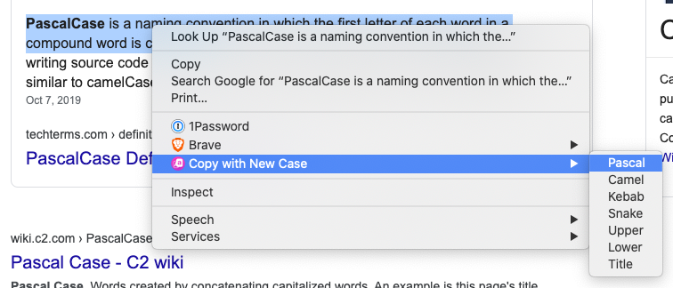

# Copy with New Case

### A Simple Chrome Extension to Help You **Copy Selected Browser** **Text** and **Change Its Case** (all at once)

_Only available via manual install at the moment_

## How to install manually 📦

1. Clone the Repo to a local folder
1. Visit Your Chrome Extensions View
1. Toggle on the Developer Mode
1. Select Load Unpacked
1. Choose the cloned repo folder
1. Restart your browser 💥

## How to use 👟

1. Select text on any website
2. Right Click and Select **Copy with New Case**
3. Choose your new case and paste it where you like!

## Works in ❤️

- Brave
- Chrome

## PRs are welcome!
